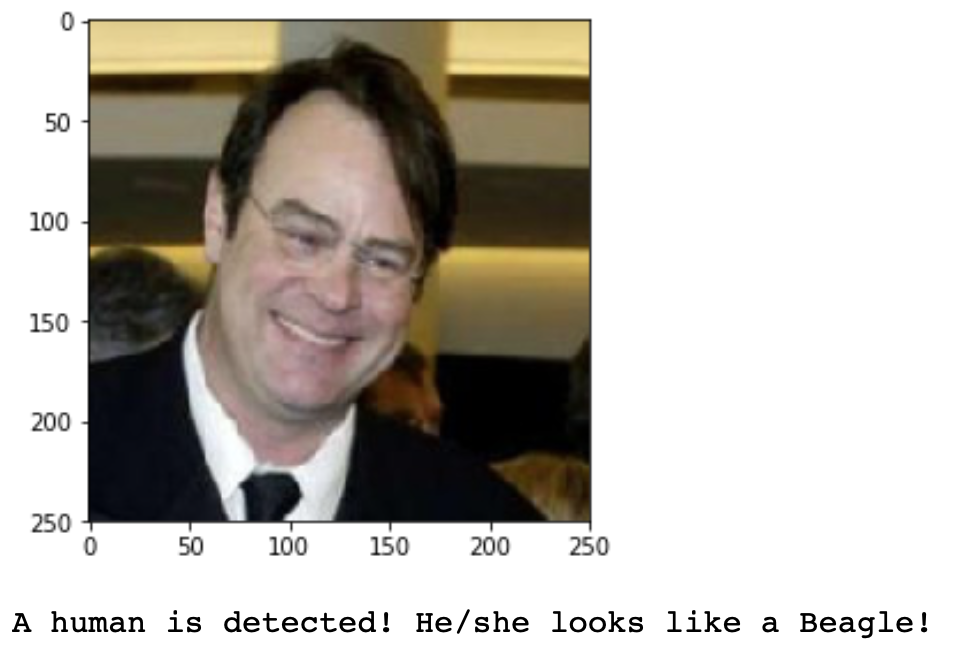

# Machine Learning Engineer Nanodegree
## Capstone Project - Dog Breed Classifier
Zhikun Lu  
Sep 2nd, 2021

## I. Definition
### Project Overview
With the recent advancement in computer vision, machine learning technologies have been widely used in real world to solve real problems. A well-known example is the Face ID developed by Apple, used by tens of millions of people everyday. At the core of a technology like this is deep learning, or more specifically, deep convolutional neural networks (CNNs), which are extremely powerful for image recognition tasks. 

Pioneered by Yann LeCun et al. (1989), CNNs are able to recognize image patterns utilizing its unique architecture. The power of CNNs is then fully awakened by GPU computing (Chellapilla et al, 2006), where training a large-scale CNN became feasible. Nowadays, well-trained CNNs can achieve super-human performance in many image recognition tasks.

In this project, I will build a pipeline to process real-world, user-supplied images, and then train CNNs using these image data with the help of GPU computing. The fully trained model is expected to achieve near-human performance in dog breed classification.

### Problem Statement
The central goal of this project is to design and implement a machine-learning-powered application to classify a dog's breed when given a photo. For example, when a photo of dog (see the following picture) is presented, the application is expected to give its correct breed, Labrador Retriever. 


To achieve this goal, I will 

1. build and train a CNN from scratch, and
2. use a transfer learning model.

Moreover, as a by-product, our application can give a predicted dog breed for a human image. We can interpret this model output as the person resembling the predicted dog breed the most. 

### Metrics
I use the following accuracy rate to measure the models' performance:

$$\text{Accuracy rate}=\dfrac{\text{The number of images correctly classified}}{\text{The total number of images}},$$
which is consistent with our common sense.

For model training, I use the cross-entropy loss, a fairly standard choice for multi-class classification problems. Though this metric looks less intuitive, the idea behind it is similar to the accuracy rate we defined above. Only some nonlinear transformation is applied, which makes it work better with deep learning and backpropogation. More technical details can be found in the [Pytorch document](https://pytorch.org/docs/master/generated/torch.nn.CrossEntropyLoss.html#torch.nn.CrossEntropyLoss). 


## II. Analysis
### Data Exploration

All datasets for this project are provided by Udacity. 

Since the primary goal is to train a deep learning model to classify a bog's breed, the main inputs are images of dog and labels.  

- Dog image dataset (main). It can be downloaded from [here](https://s3-us-west-1.amazonaws.com/udacity-aind/dog-project/dogImages.zip). 
  - There are 8351 total dog images, where 6680 of them are used for training, 836 for testing, and 835 for validation. 
  - Further, there are 133 different dog breeds, which serve as labels for the classification problem. 
  - The sample is not completely balanced. 
    In the training set, the breed with largest size has 77 images, while the one with smallest size has only 26 images. This is natural as the data is collected from real world. The following graph shows the histogram of sample size in the training set:
    

Occasionally, the project uses human images for comparison and/or other goals. 

- Human image dataset (supplementary). It can be downloaded from [here](http://vis-www.cs.umass.edu/lfw/lfw.tgz). 
  - There are 13233 total human images.  Note that we do not use human images to train our CNNs.

Here are some examples of dog pictures:

  

As we can see, the images are different in shapes. Some are wider than others. The following graph further shows the image size varies greatly,


where I plot the image width against image height in a scatter plot using the first 1000 images from the training set. 

Next, I show some human images. They are not used for model training but will be used to generate some interesting outputs from our application later.

  

### Algorithms and Techniques

I mainly use CNNs to solve our central image classification problem. CNNs are a class of artificial neural network that have been widely used for image processing and analysis. Their unique network architecture is able to capture two-dimensional features in pictures and then use these features to draw conclusions. CNNs are believed to be one of the most powerful machine/deep learning technologies for image processing.

I employ two types of CNN-based models to tackle our problem:

1. A CNN build from scratch. 
   As a starting point, I will design and train a small scale CNN model using my laptop. A toy model should work to some extent but may not be powerful enough to achieve high performance. 
2. A transfer learning model utilizing model parameters from a pre-trained CNN. 
   Transfer learning allows our model to use "knowledge" from other trained CNN models to serve our goal. Those trained CNN models are usually large in scale and powerful in performance, but not tailored for our task at hand. By utilizing their "knowledge" and train a transfer learning model, one can potentially achieve high model performance very fast.

The models are trained with the standard backpropagation methods. Further, I use GPU to accelerate the training process.

### Benchmark

- The benchmark for a CNN model built from scratch. 
  I set the benchmark accuracy rate to be 10%. This number falls within the common range of the community. Though it may seem a little bit low, this level is way higher than a random guess, the accuracy rate of which is approximately 0.75% (1/133).
- The benchmark for a CNN model with transfer learning. 
  I set the benchmark accuracy rate for the transferred model to be 80%. As a person who can barely differentiate one breed from another, I believe this is a pretty high standard.


## III. Methodology
The technical part of this project mainly consists of the following three components:

1. Load and pre-process the image data
   To expand effective sample size and to reduce overfitting, I resize, rotate, flip and crop images in a random manner. 
2. Train a CNN model from Scratch
   I fisrt implement a CNN with three convolutional layers. Though small in size, it achieves an accuracy rate of 13%, which is pretty good. 
3. Train a CNN model with transfer learning
   I employ the VGG16 model for transfer learning. The accuracy rate can reach 80%, a very impressive level.

### Data Preprocessing
As we have seen in the data exploration section, the dog images are highly heterogeneous in shape and size. However, deep learning models usually require uniform data inputs. To solve this issue, I rescale all images to a size of 224$\times$224. This is the exact size that works for VGG16 in transfer learning. 

Further, I employ different image transformation techniques to increase the effective sample size and to reduce overfitting, including chopping, flipping and rotation. While deep learning models are powerful, they are prone to an overfitting problem. For example, when all dog images used for training are properly positioned, a trained model may have a hard time classifying a new image with a dog image being upside down, because their mathematical representations are intrinsically different. Ideally, no matter how we present the image content, a model should be able to give the same prediction as the content remains the same. However, it is pretty hard to guarantee this property theoretically. From this perspective, the models have difficulty in generalizing the learned patterns. Nonetheless, we can circumvent this issue by providing more images with different positions. By properly chopping, flipping, and rotating the training images, the trained model will be able to learn the generalized patterns as they are directly provided by the training data.

### Implementation

#### CNN from scratch

The network has three convolutional layers to extract features from images, each accompanied with a 2-by-2 max pooling layer and a ReLU activation function.

- The 1st layer has 3 input channels (for an RGB image) and 32 output channels. I set `stride=2` to downsize the output "image". Combined with a 2-by-2 max pooling layer, the output image is 56$\times$56, while the input is 2242$\times$24.
- The 2nd layer has 32 input channels and 64 output channels.
- The 3rd layer has 64 input channels and 128 output channels.

I use ReLU as the activation function, a popular choice for deep learning models. Also, maxpooling layers are used to reduce dimensionality.

Following the convolutional layers, we have two fully connected layers, where I also add dropout layers to mitigate overfitting. 

The following codes provide the details of the network structure.

```Python
class Net(nn.Module):
    def __init__(self):
        super(Net, self).__init__()
        # Define layers of a CNN
        self.conv1 = nn.Conv2d( 3, 32,3,stride=2,padding=1)
        self.conv2 = nn.Conv2d(32, 64,3,stride=1,padding=1)
        self.conv3 = nn.Conv2d(64,128,3,stride=1,padding=1)
        # Pooling
        self.pool = nn.MaxPool2d(2,2)
        # Full connected layers
        self.fc1 = nn.Linear(128*14*14,4096)
        self.fc2 = nn.Linear(4096,133)
        # drop-out layer
        self.dropout = nn.Dropout(0.25)
        
    def forward(self, x):
        # Define forward behavior
        x = self.pool(F.relu(self.conv1(x))) # size-in  3*224*224, size-out  32*56*56
        x = self.pool(F.relu(self.conv2(x))) # size-in 32* 56* 56, size-out  64*28*28
        x = self.pool(F.relu(self.conv3(x))) # size-in 64* 28* 28, size-out 128*14*14
        # flatten
        x = x.view(-1, 128*14*14)
        # fc layer
        x = self.dropout(x)
        x = F.relu(self.fc1(x))
        x = self.dropout(x)
        x = self.fc2(x)
        return x
```

Compared to sophisticated CNN architectures such as that of VGG16, my model is rather simple and small in size. However, given the limited computational power and moderate accuracy target, the model should do the job.

#### Transfer learning

I use VGG16 for transfer learning. VGG16 is widely believed be to a good architecture for transfer learning. To simplify the training process, I only modified the final layer to fit our taks, since we have 133 different dog breeds. The [Pytorch](https://pytorch.org/vision/stable/models.html) document provides more technical details of VGG16. Here is my implementation.

```Python
import torchvision.models as models
import torch.nn as nn

## Specify model architecture 
model_transfer = models.vgg16(pretrained=True)

# Freeze training for all "features" layers
for param in model_transfer.features.parameters():
    param.requires_grad = False

# change the last layer for our dog breed classification task
n_inputs = model_transfer.classifier[6].in_features
last_layer = nn.Linear(n_inputs,133)
model_transfer.classifier[6] = last_layer
```

#### Loss Function and Optimizer

For both models, I use cross entropy loss as the optimization criterion and the stochastic gradient descent method for optimization, which are faily standard choice. The learning rate for CNN from scratch is set to be 0.05, while the one for transfer learning to be 0.001. 

```python
import torch.optim as optim

### select loss function
criterion_scratch = nn.CrossEntropyLoss()
criterion_transfer = nn.CrossEntropyLoss()

### select optimizer
optimizer_scratch = optim.SGD(model_scratch.parameters(), lr=0.05)
optimizer_transfer = optim.SGD(model_transfer.classifier.parameters(), lr=0.001)
```

### Refinement

#### CNN from scratch

I initially tried an even smaller CNN with only two convolutional but found its performance modest. It barely achieves the benchmark (i.e., 10% accuracy rate) after several rounds of tuning other hyper-parameters. Then, I add a third convolutional layer and expand the layer size, leading to the current version. A conventional wisdom is that more complicated models tend to perform better when properly trained. This turned out to be the case here. The accurate rate increased from slightly above 10% to around 22%.  

I also experimented on different learning rates. It seems a learning rate of 0.05 works pretty well, with which the training process is fast without convergence issues.

#### Transfer learning

The transfer learning model works amazingly well without much refinement in model architecture. However, the 0.05 learning rate, which works well for the CNN from scratch, no longer works for the transfer learning problem. I lowered the learning rate to 0.001 to gain convergence.

## IV. Results

### Model Evaluation and Validation

#### CNN from scratch

After 30 epochs of training, the training loss decreases from the initial level 4.85 to 2.93. However, the validation loss remains around 3.5 after 20 epochs of training, which implies the model has been properly trained. Further training is likely to incur overfitting. 

The resting loss is 3.23, and the model correctly classified 190 dogs' breeds out of a total of 836 dog images, an accuracy rate of 22%, which is much higher than the benchmark. This is a pretty good result, given the relatively small network size and limited computing capacity devoted. Nonetheless, I think an application with this accuracy rate is not very helpful in real world.

#### Transfer learning

I also trained the model for 30 epochs. The initial training loss is 4.23, which is similar to the CNN from scratch. However, when the 2nd epoch is finished, the training loss went down to 2.78, which is already smaller than the best performance achieved by the CNN from scratch. After 30 epochs, the training and validation loss became as low as 0.36. 

Next, I use the test dataset to evaluate the trained model. The test loss is 0.42, and the accuracy is 87%, a surprisingly high level. Thus, transfer learning is extremely powerful, even though I only spent a few hours to train the model. I believe this accuracy rate is better than most human nonexperts. Thus, the model can be useful in real world.

## V. Conclusion

### Free-Form Visualization

Our transfer learning model works very well. Based on the trained model, we developed a toy app that takes in images. It first utilize the OpenCV's detector (a third party module) to decide what kind of image it receives.

- If the image contains a dog, the app will print the predicted dog breed. See the following examples. For most of the time, the app can correctly classify the dog's breed.
   

- If the image contains a human face, the app will still feed the image into the model and find out the most resembling dog breed. Below are some examples. 
   

- The image contains neither a human face nor a dog, the program will provide output that indicates an error.

### Reflection

The core technical task in the project mainly consists of the following three components:

1. Load and pre-process the image data
2. Train a CNN model from Scratch
3. Train a CNN model with transfer learning

As a by-product, I also built an app that utilizes the trained CNN to produce some interesting message.

Overall, I think the transfer learning works amazingly well for this dog breed classification problem. For similar future tasks, I believe one should start with transfer learning models. This solution sometimes can provide extremely good performance while only consumes a small amount of time and computing resource. 

### Improvement
Deep learning models are very rich in parameters and hyper-parameters. Tuning the models can be more of an art than science. In this project, due to the time constraint, I did not experiment much on hyper-parameters. Probably, I can utilize cloud computing resource to tune more hyperparameters in the future. 

A more promising direction, in my view, is to experiment on different transfer learning models. The performance gain brought by VGG16 is so large that makes me wonder whether there are even better alternatives out there. Since I only tried VGG16, it is reasonably to guess other models can achieve better performance. Thus, a follow-up project could be comparing the performance of alternative transfer learning models, where the 87% accuracy rate achieved by VGG16 can be set as the new benchmark. 


### Reference

1. LeCun, Yann, et al. "Backpropagation applied to handwritten zip code recognition." Neural computation 1.4 (1989): 541-551.
2. Chellapilla, Kumar, Sidd Puri, and Patrice Simard. "High performance convolutional neural networks for document processing." Tenth international workshop on frontiers in handwriting recognition. Suvisoft, 2006.
3. CNN Project: Dog Breed Classifier, Udacity's github repository https://github.com/udacity/deep-learning-v2-pytorch/tree/master/project-dog-classification 
4. The Dog image dataset https://s3-us-west-1.amazonaws.com/udacity-aind/dog-project/dogImages.zip
5. The human image dataset http://vis-www.cs.umass.edu/lfw/lfw.tgz
6. PyTorch Document for cross entropy loss https://pytorch.org/docs/master/generated/torch.nn.CrossEntropyLoss.html
7. PyTorch Document for VGG16 https://pytorch.org/vision/stable/models.html 
